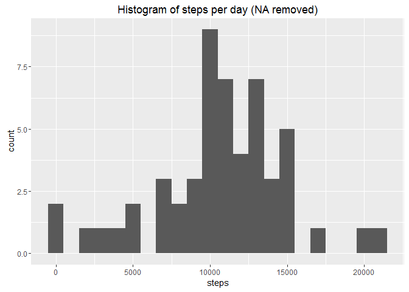
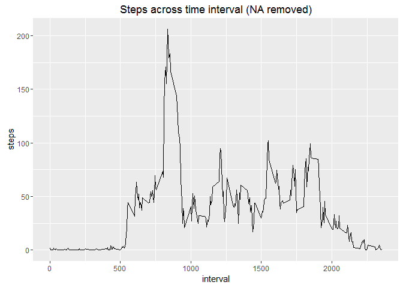
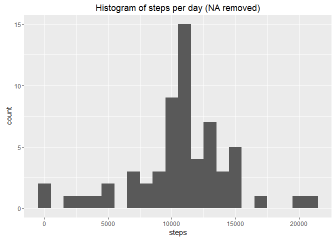
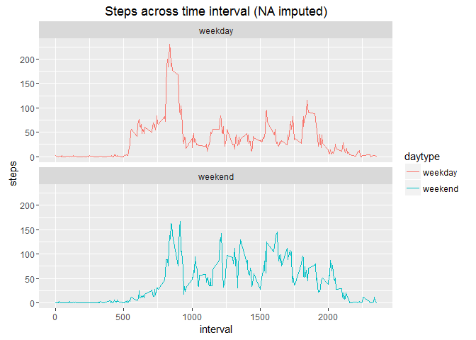

# Reproducible Research: Peer Assessment 1
Wu Peng  
15th Jan 2017  
## Loading necessary package

```r
library(lubridate)
library(dplyr)
library(ggplot2)
```

## Loading and preprocessing the data

1. Load the data

```r
data <- read.csv(unz("activity.zip","activity.csv"))
```
2. Process/transform the data (if necessary) into a format suitable for analysis
Transform the date column into a date formate

```r
data$date <- ymd(data$date)
```

## What is mean total number of steps taken per day?
1. Make a histogram of the total number of steps taken each day


```r
steps_per_date <- data %>%
        filter(!is.na(steps)) %>%
        group_by(date) %>%
        summarise(steps = sum(steps)) 

ggplot(steps_per_date, aes(x=steps)) + 
        geom_histogram(binwidth = 1000) +
        labs(title = "Histogram of steps per day (NA removed)")
```

<!-- -->

2. Calculate and report the mean and median total number of steps taken per day

```r
mean(steps_per_date$steps)
```

```
## [1] 10766.19
```

```r
median(steps_per_date$steps)
```

```
## [1] 10765
```

## What is the average daily activity pattern?
1. Make a time series plot (i.e. type = "l") of the 5-minute interval (x-axis) and the average number of steps taken, averaged across all days (y-axis)

```r
steps_across_interval <- data %>%
        filter(!is.na(steps)) %>%
        group_by(interval) %>%
        summarise(steps = mean(steps)) 

ggplot(steps_across_interval, aes(x=interval,y=steps)) +
        geom_line() +
        labs(title = "Steps across time interval (NA removed)")
```

<!-- -->

2. Which 5-minute interval, on average across all the days in the dataset, contains the maximum number of steps?

```r
steps_across_interval[which.max(steps_across_interval$steps),]
```

```
## # A tibble: 1 × 2
##   interval    steps
##      <int>    <dbl>
## 1      835 206.1698
```


## Imputing missing values
1. Calculate and report the total number of missing values in the dataset (i.e. the total number of rows with NAs)

```r
sum(is.na(data$steps))
```

```
## [1] 2304
```

2. Devise a strategy for filling in all of the missing values in the dataset. 
Here we are going to use the mean of steps in each 5-minute interval to fill the missing value

```r
avg_by_interval <- tapply(data$steps, data$interval, mean, na.rm=TRUE, simplify=TRUE)
isNa <- is.na(data$steps)
filling_values <- avg_by_interval[as.character(data$interval[isNa])]
```

3. Create a new dataset that is equal to the original dataset but with the missing data filled in.

```r
data_full <- data
data_full$steps[isNa] <- filling_values
sum(is.na(data_full$steps))
```

```
## [1] 0
```
4. Make a histogram of the total number of steps taken each day and Calculate and report the mean and median total number of steps taken per day. Do these values differ from the estimates from the first part of the assignment? What is the impact of imputing missing data on the estimates of the total daily number of steps?

Make a histogram of the total number of steps taken each day using the new dataset.

```r
steps_per_date_full <- data_full %>%
        group_by(date) %>%
        summarise(steps = sum(steps)) 

ggplot(steps_per_date_full, aes(x=steps)) + 
        geom_histogram(binwidth = 1000) +
        labs(title = "Histogram of steps per day (NA removed)")
```

<!-- -->

We can see that the histogram is slithly different from previous one.

Calculate the new mean and median again.

```r
mean(steps_per_date_full$steps)
```

```
## [1] 10766.19
```

```r
median(steps_per_date_full$steps)
```

```
## [1] 10766.19
```

We can see that the mean remains not changed while the median is slightly increased. The change is relatively small and is acceptable.

## Are there differences in activity patterns between weekdays and weekends?
1. Create a new factor variable in the dataset with two levels - "weekday" and "weekend" indicating whether a given date is a weekday or weekend day.

```r
data_full <- mutate(data_full,
                    daytype = ifelse(weekdays(date)== "Sunday" | 
                                             weekdays(date)== "Saturday","weekend","weekday"))
```

2. Make a panel plot containing a time series plot (i.e. type = "l") of the 5-minute interval (x-axis) and the average number of steps taken, averaged across all weekday days or weekend days (y-axis). 

```r
steps_across_interval_full <- data_full %>%
        group_by(interval,daytype) %>%
        summarise(steps = mean(steps)) 

ggplot(steps_across_interval_full, aes(x=interval,y=steps, color = daytype)) +
        geom_line() +
        facet_wrap(~daytype, ncol = 1, nrow=2) +
        labs(title = "Steps across time interval (NA imputed)")
```

<!-- -->
